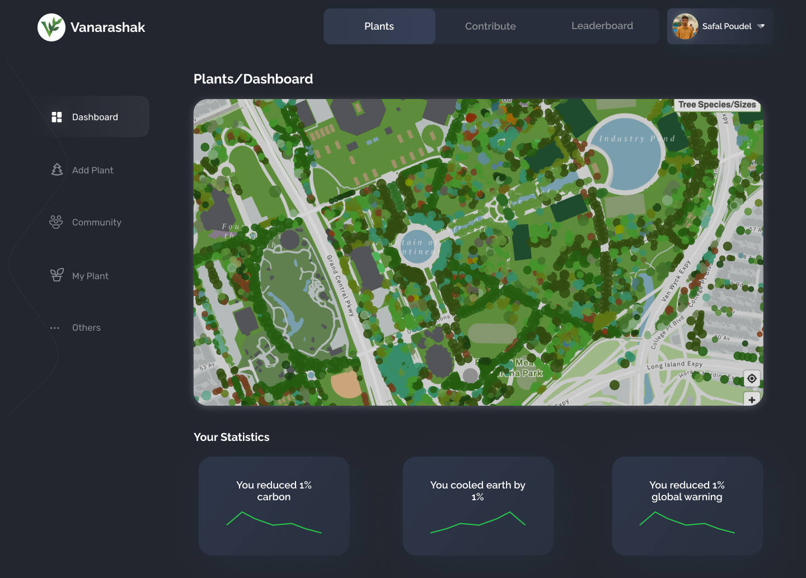
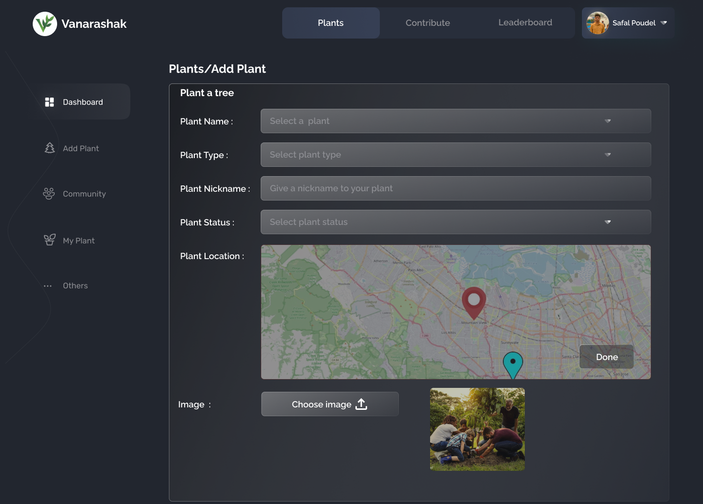
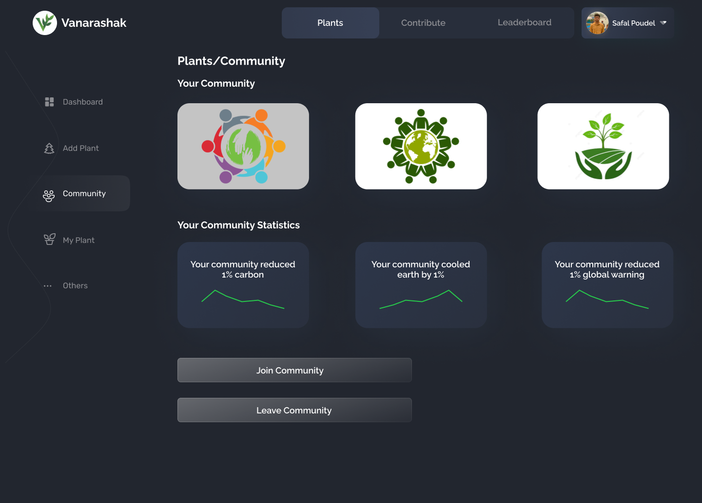
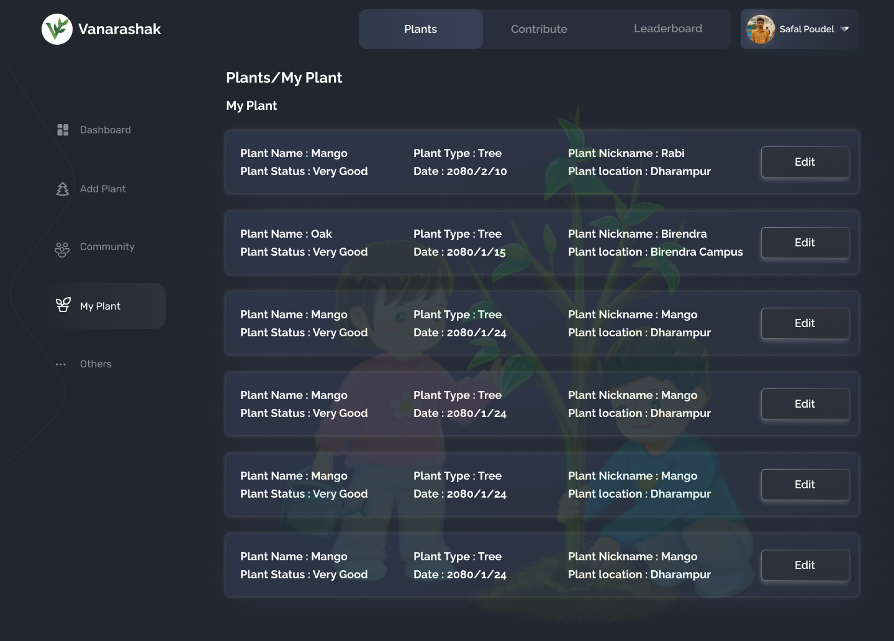
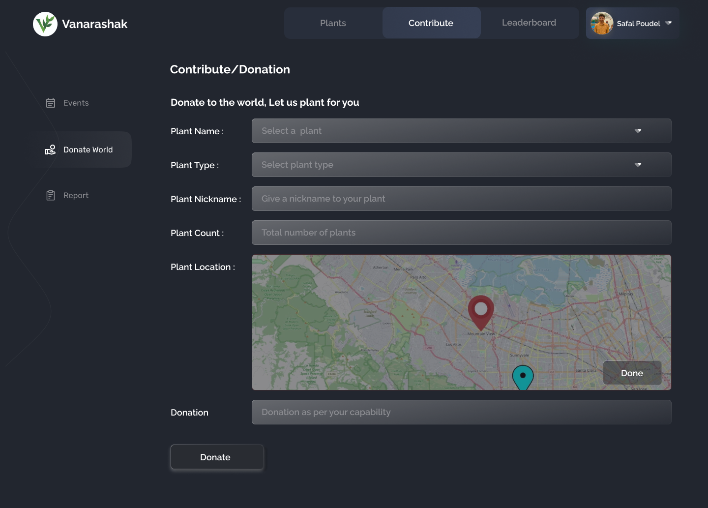
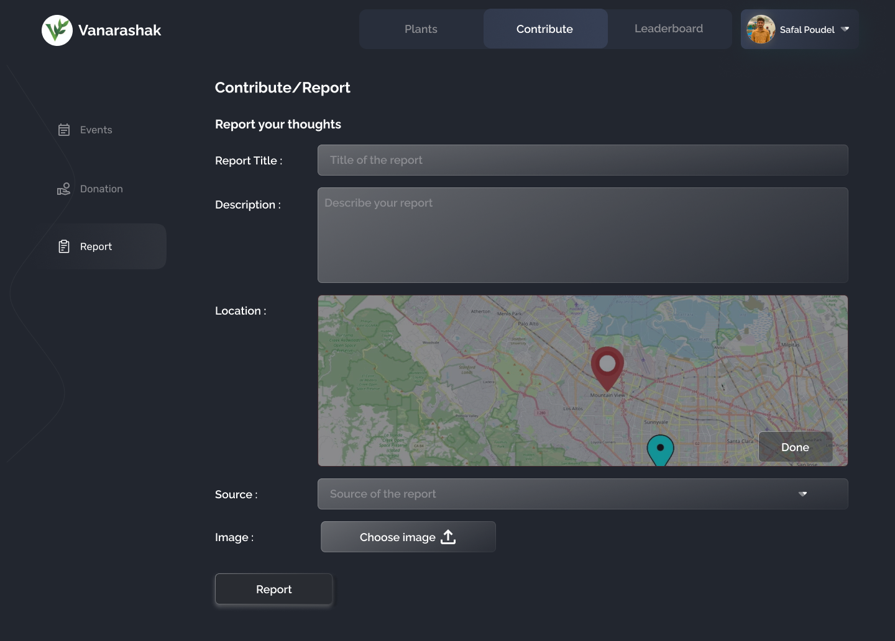

# [OSM Hackfest](https://drive.google.com/file/d/1zdODYEAyuHUmg1cGePp1vumnC3KFwJov/view?usp=sharing)

## About The Project

Saving Trees, Saving Lives.

### Built With

This project is build with following languages and framework

-   [Nodejs](https://nodejs.org/en/)
-   [Vite.js](https://www.npmjs.com/package/socket.io)
-   [Express](https://www.npmjs.com/package/express)
-   [Mongoose](https://www.npmjs.com/package/mongoose)
-   [Passport](https://www.npmjs.com/package/passport)
-   [Axios](https://www.npmjs.com/package/express-session/)

<!-- GETTING STARTED -->

## Getting Started

This is an example of how you may give instructions on setting up your project locally.
To get a local copy up and running follow these simple example steps.

### Prerequisites

-   Text editor (Vscode, Sublime text, Notepad++ or any)

### Installation

1. Clone the repository

2. Open a terminal, navigate to Root directory .

```sh
   cd osm
```

3. Build npm dependencies

```sh
   npm i
```

4. Copy environment variables examples from `env.example` or Create .env file in root directory and paste

```sh
   MONGO_CONNECT=mongodb://localhost:27017/userDB
```

4. Run with node or nodemon

```sh
   npm start
   npm run dev
```

## Working

-   ### Dashboard
    
   All your plants in map view
-   ### Add Plant
     
-   ### Grow with Community
     
-   ### All the plants you've planted
     
-   ### Contribute
     
-   ### Report forest-fire and other mishaps
     
-   ### Leaderboard
     

## Contributing

This document describes the workflow for submissions or contributions for osm

_Note : While working with github from the command line it is best to [setup SSH Keys](https://docs.github.com/en/authentication/connecting-to-github-with-ssh/generating-a-new-ssh-key-and-adding-it-to-the-ssh-agent) (this will save you a lot of hassle)._

### Setting up your own copy of the repository

1. **Fork the repo on GitHub to your personal account.** Click the `Fork` button on the page. (this needs to be done only once.)

2. **Clone the repository.** Click the green "Clone or download" button ①, and copy the repository's URL ② and

    type `git clone repo-url` in terminal

### Adding Changes

Before you make any changes, you should make a branch. Remember to **never commit to main**. The command `git status` will tell you what branch you are on. Customizing your terminal to show your git branch makes it easier to keep track of branch.

1. **Update main.** Before you make any changes, first checkout main

```bash
git checkout main
```

and pull latest changes

```bash
git pull
```

2. **If it is the first time Create a new branch, or switch to your branch.** After cloning the repository, create a new branch. We will follow a structure in which each contributor contributes to his/her own branch. For example I will create a branch named `feature`

    - You can create a new branch as,

    ```bash
    git checkout -b <branch-name>

    git checkout -b frontend
    ```

    - If the branch exists

    ```bash
    git checkout <branch-name>
    ```

3. **Make your changes and commit them.** Once you have created your branch, make your changes and commit them. Remember to keep your commits atomic, that is, each commit should represent a single unit of change. Also, remember to write helpful commit messages, so that someone can understand what the commit does just from reading the message without having to read the diff.

For example, at the command line, this might look like

```
git add filename [filename ...]
git commit -m "descriptive message of what you did"
```

4. **Push up your changes.** Push your changes to your fork. Do this by running

```bash
git push origin branch-name
```

5. **Make a pull request.** If you then go to your fork on GitHub, you should see a button to create a pull request from your branch.

6. Once doing this, you will be presented with a page. This page will show you the diff of the changes. Double check them to make sure you are making a pull request against the right branch.

    - Enter a descriptive title in the title field. This is very important, as it is what will show up in the pull request listing and in email notifications to the people in the repo. Pull requests with undescriptive titles are more likely to be passed by.

7. **Pushing additional changes**. Once you have created the pull request, it will likely be reviewed and some additional fixes will be necessary. **Do not create a new pull request.** Rather, simply make more commits to your branch and push them up as in steps 3 and 4. They will be added to the pull request automatically.

Once the pull request has been reviewed successfully, someone with push access to the main repository will merge it in.
